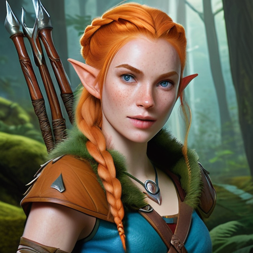

# Fae - The Lone Wolf

| Fae Vandorvil |               |
|---------------|---------------|
| Age           | 24            |
| Class         | Druid         |
| Race          | Wood Elf      |
| Alignment     | Neutral Good  |
| Background    | Hermit        |
| Player        | Dana          |

## Biography

- abandoned by biological parents at birth in the deep winter of peak side woods near an inhabitated lodge

- found, raised and adopted by the lodge inhabitants: a female druid wood elf Llaina and a male firbolg Aemaer, who fell in love with each other after Aemaer leaped through a portal and escaped from his society

- adoptive mother Llaina is part of the druidic circle of the land but keeps her love relationship a secret

- Fae grew up in the rough nature, befriended with wolves and other creatures and soon chose to be a druid to study nature, balance, animals and herbalism

- she rarely had friends and, unlike other elves, loves using crude and vulgar language

## Character

<object data="Fae_CharacterSheet.pdf" type="application/pdf" width="816px" height="1024x">
    <embed src="Fae_CharacterSheet.pdf">
        
This browser does not support PDFs. Please download the PDF to view it: <a href="Fae_CharacterSheet.pdf">Download PDF</a>.

    </embed>
</object>
